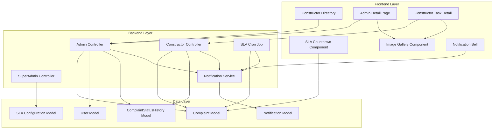

# Design Document: Admin & Constructor Panel Improvements

## Overview

This design addresses 7 critical usability and reliability issues in the RCMS (RoadCare Management System) Admin and Constructor panels. The improvements span UI enhancements, notification reliability, SLA management, and image handling across the complaint lifecycle.

### Problem Statement

The current system has several gaps:
1. Constructor directory lacks workload visibility and search capabilities
2. No enforcement of photo upload limits (5 max for completion proof)
3. Missing SLA configuration system for priority-based deadlines
4. No visual SLA countdown displays across panels
5. Incomplete notification triggers during task status updates
6. Admin panel doesn't display constructor completion photos
7. No image gallery with lightbox for viewing multiple images
8. Notification bell component has reliability issues

### Solution Approach

The solution introduces:
- **SLAConfiguration Model**: Centralized storage for priority-based SLA durations
- **Enhanced Constructor Directory**: Grid layout with workload indicators, search, and filtering
- **Photo Upload Validation**: Frontend (5 max) and backend (1-5 range) enforcement
- **SLACountdown Component**: Reusable React component with color-coded time display
- **ImageGallery Component**: Reusable lightbox gallery for all detail pages
- **Notification Enhancements**: Comprehensive triggers across all lifecycle events
- **Completion Photo Display**: Dedicated section in admin detail view with timestamps
- **SLA Monitoring Cron**: 15-minute interval job for breach detection

### Technology Stack

- **Backend**: Node.js/Express, MongoDB with Mongoose
- **Frontend**: React with React Router, day/night theme support
- **Image Storage**: Cloudinary (primary) with local fallback
- **Scheduling**: node-cron for SLA monitoring
- **Notifications**: In-app notification service with polling

## Architecture

### System Components



### Data Flow

#### SLA Configuration Flow
1. Super Admin updates SLA durations via PUT /api/superadmin/sla-config
2. System validates duration hierarchy (high < medium < low)
3. Configuration stored in SLAConfiguration collection
4. When Admin assigns priority to complaint, system calculates slaDueDate using current config
5. SLA cron job monitors slaDueDate every 15 minutes
6. On breach detection, system sets isSlaBreached=true and creates notifications

#### Photo Upload Flow
1. Constructor selects images (frontend validates ≤5)
2. Form submission includes FormData with images array
3. Backend middleware processes uploads (Cloudinary or local)
4. Backend validates 1-5 image count before processing
5. Images stored in ComplaintStatusHistory with status='completed'
6. Admin retrieves ComplaintStatusHistory records to display completion photos

#### Notification Flow
1. Lifecycle event occurs (status change, assignment, breach)
2. Controller calls notificationService.createNotification()
3. Notification document created with user, complaint, type, title, message
4. Frontend NotificationBell polls every 60 seconds
5. Unread notifications displayed with bold styling and red dot indicator
6. User clicks notification → marked as read, navigates to complaint

## Components and Interfaces

### Backend Models

#### SLAConfiguration Model
```javascript
// backend/models/SLAConfiguration.js
const mongoose = require('mongoose');

const slaConfigurationSchema = new mongoose.Schema({
  high: {
    type: Number,
    required: true,
    default: 24, // hours
    min: 1
  },
  medium: {
    type: Number,
    required: true,
    default: 72, // hours
    min: 1
  },
  low: {
    type: Number,
    required: true,
    default: 168, // hours (7 days)
    min: 1
  },
  updatedBy: {
    type: mongoose.Schema.Types.ObjectId,
    ref: 'User',
    default: null
  }
}, {
  timestamps: true
});

// Validation: ensure high < medium < low
slaConfigurationSchema.pre('save', function(next) {
  if (this.high >= this.medium || this.medium >= this.low) {
    return next(new Error('SLA durations must follow: high < medium < low'));
  }
  next();
});

module.exports = mongoose.model('SLAConfiguration', slaConfigurationSchema);
```

**Design Rationale**: Single document approach (singleton pattern) ensures consistency. Validation middleware enforces logical duration hierarchy. Timestamps track configuration changes for audit purposes.

#### Complaint Model Extensions
```javascript
// Existing fields remain, these are already present:
// - slaDueDate: Date
// - isSlaBreached: Boolean
// - priority: String (enum: ['low', 'medium', 'high'])

// No schema changes needed, but usage pattern changes:
// When Admin assigns priority, calculate slaDueDate:
// slaDueDate = new Date(Date.now() + slaConfig[priority] * 60 * 60 * 1000)
```

#### ComplaintStatusHistory Model Extensions
```javascript
// Existing schema already supports:
// - images: [String] (array of image URLs)
// - comments: String
// - updatedBy: ObjectId (ref: User)
// - createdAt: Date (timestamp)

// No schema changes needed
// Usage: Filter by status='completed' to get completion photos
```

### Backend API Endpoints

#### SLA Configuration Endpoints

**GET /api/superadmin/sla-config**
- **Access**: Super Admin only
- **Response**:
```json
{
  "success": true,
  "data": {
    "_id": "...",
    "high": 24,
    "medium": 72,
    "low": 168,
    "updatedBy": "...",
    "updatedAt": "2024-01-15T10:30:00Z"
  }
}
```

**PUT /api/superadmin/sla-config**
- **Access**: Super Admin only
- **Request Body**:
```json
{
  "high": 24,
  "medium": 72,
  "low": 168
}
```
- **Validation**:
  - All values must be positive integers
  - high < medium < low
  - Returns 400 with error message if validation fails
- **Response**:
```json
{
  "success": true,
  "message": "SLA configuration updated successfully",
  "data": { /* updated config */ }
}
```

#### Constructor Endpoints Enhancement

**GET /api/admin/constructors**
- **Enhancement**: Add activeTasks count to response
- **Current Implementation**: Already includes activeTasks via aggregation
- **No changes needed**

**PUT /api/constructor/tasks/:id/status**
- **Enhancement**: Add photo count validation
- **Validation Logic**:
```javascript
// Before processing uploads
if (req.files && req.files.length > 5) {
  return res.status(400).json({
    success: false,
    message: 'Maximum 5 photos allowed for completion proof'
  });
}

if (status === 'completed' && (!req.files || req.files.length === 0)) {
  return res.status(400).json({
    success: false,
    message: 'At least 1 photo required for completion proof'
  });
}
```

### Backend Controllers

#### SuperAdmin Controller - SLA Configuration
```javascript
// backend/controllers/superAdminController.js

const SLAConfiguration = require('../models/SLAConfiguration');

/**
 * @desc    Get current SLA configuration
 * @route   GET /api/superadmin/sla-config
 * @access  Private (Super Admin)
 */
const getSLAConfig = async (req, res, next) => {
  try {
    // Get the singleton config document (or create default if doesn't exist)
    let config = await SLAConfiguration.findOne();
    
    if (!config) {
      config = await SLAConfiguration.create({
        high: 24,
        medium: 72,
        low: 168
      });
    }
    
    res.json({ success: true, data: config });
  } catch (err) {
    next(err);
  }
};

/**
 * @desc    Update SLA configuration
 * @route   PUT /api/superadmin/sla-config
 * @access  Private (Super Admin)
 */
const updateSLAConfig = async (req, res, next) => {
  try {
    const { high, medium, low } = req.body;
    
    // Validate input
    if (!high || !medium || !low) {
      return res.status(400).json({
        success: false,
        message: 'All SLA durations (high, medium, low) are required'
      });
    }
    
    // Validate positive integers
    if (high <= 0 || medium <= 0 || low <= 0) {
      return res.status(400).json({
        success: false,
        message: 'SLA durations must be positive integers'
      });
    }
    
    // Validate hierarchy
    if (high >= medium || medium >= low) {
      return res.status(400).json({
        success: false,
        message: 'SLA durations must follow: high < medium < low'
      });
    }
    
    // Update or create config
    let config = await SLAConfiguration.findOne();
    
    if (!config) {
      config = new SLAConfiguration({ high, medium, low, updatedBy: req.user._id });
    } else {
      config.high = high;
      config.medium = medium;
      config.low = low;
      config.updatedBy = req.user._id;
    }
    
    await config.save();
    
    console.log(`✅ SLA Config updated by ${req.user.name}: high=${high}h, medium=${medium}h, low=${low}h`);
    
    res.json({
      success: true,
      message: 'SLA configuration updated successfully',
      data: config
    });
  } catch (err) {
    next(err);
  }
};

module.exports = {
  // ... existing exports
  getSLAConfig,
  updateSLAConfig
};
```

#### Admin Controller - Assignment Enhancement
```javascript
// backend/controllers/adminController.js
// Enhancement to assignComplaint function

const SLAConfiguration = require('../models/SLAConfiguration');

const assignComplaint = async (req, res, next) => {
  try {
    const { priority, constructorId } = req.body;
    
    const complaint = await Complaint.findById(req.params.id);
    if (!complaint) return res.status(404).json({ success: false, message: 'Complaint not found' });
    
    if (complaint.ward.toString() !== req.user.ward.toString()) {
      return res.status(403).json({ success: false, message: 'Not authorized for this ward' });
    }

    const constructor = await User.findOne({ _id: constructorId, role: 'constructor' });
    if (!constructor) return res.status(400).json({ success: false, message: 'Invalid constructor' });

    // NEW: Calculate SLA due date based on priority
    const slaConfig = await SLAConfiguration.findOne();
    const slaDurationHours = slaConfig ? slaConfig[priority] : (priority === 'high' ? 24 : priority === 'medium' ? 72 : 168);
    const slaDueDate = new Date(Date.now() + slaDurationHours * 60 * 60 * 1000);

    complaint.priority = priority;
    complaint.assignedConstructor = constructorId;
    complaint.assignedAdmin = req.user._id; // Track which admin assigned
    complaint.status = 'assigned';
    complaint.assignedAt = new Date();
    complaint.slaDueDate = slaDueDate; // NEW
    await complaint.save();

    await ComplaintStatusHistory.create({
      complaint: complaint._id,
      status: 'assigned',
      updatedBy: req.user._id,
      comments: `Assigned to ${constructor.name} with ${priority} priority. SLA due: ${slaDueDate.toLocaleString('en-IN')}`
    });

    // NEW: Notify Constructor
    await createNotification(
      constructorId,
      'New Task Assigned',
      `You have been assigned to Complaint ${complaint.complaintNumber} with ${priority} priority`,
      'info',
      complaint._id
    );

    res.json({ success: true, message: 'Complaint assigned successfully', data: complaint });
  } catch (err) {
    next(err);
  }
};
```

#### Constructor Controller - Photo Validation Enhancement
```javascript
// backend/controllers/constructorController.js
// Enhancement to updateTaskStatus function

const updateTaskStatus = async (req, res, next) => {
  try {
    const { status, comments } = req.body;
    const constructorId = req.user._id;

    const complaint = await Complaint.findById(req.params.id);
    if (!complaint) return res.status(404).json({ success: false, message: 'Task not found' });

    if (complaint.assignedConstructor?.toString() !== constructorId.toString()) {
      return res.status(403).json({ success: false, message: 'Not authorized to update this task' });
    }

    if (!['in_progress', 'completed'].includes(status)) {
      return res.status(400).json({ success: false, message: 'Invalid status update' });
    }

    // NEW: Validate photo count BEFORE processing uploads
    if (req.files && req.files.length > 5) {
      return res.status(400).json({
        success: false,
        message: 'Maximum 5 photos allowed for completion proof'
      });
    }

    const uploadedImages = [];
    if (req.files && req.files.length > 0) {
      req.files.forEach(file => {
        if (file.path && file.path.startsWith('http')) {
          uploadedImages.push(file.path);
        } else {
          uploadedImages.push(`/uploads/${file.filename}`);
        }
      });
    }

    // NEW: Enforce minimum 1 photo for completion
    if (status === 'completed' && uploadedImages.length === 0) {
      return res.status(400).json({
        success: false,
        message: 'At least 1 photo required for completion proof'
      });
    }

    complaint.status = status;
    if (status === 'in_progress') complaint.startedAt = new Date();
    if (status === 'completed') complaint.completedAt = new Date();
    
    await complaint.save();

    await ComplaintStatusHistory.create({
      complaint: complaint._id,
      status: status,
      updatedBy: req.user._id,
      comments: comments || (status === 'in_progress' ? 'Constructor started the work.' : 'Work completed by constructor, awaiting admin verification.'),
      images: uploadedImages
    });

    // NEW: Enhanced notifications
    if (status === 'in_progress') {
      // Notify citizen
      await createNotification(
        complaint.user,
        'Work Started',
        `A constructor has begun working on Complaint ${complaint.complaintNumber}.`,
        'info',
        complaint._id
      );
      // NEW: Notify admin
      await createNotification(
        complaint.assignedAdmin,
        'Work In Progress',
        `Constructor has started work on Complaint ${complaint.complaintNumber}.`,
        'info',
        complaint._id
      );
    } else if (status === 'completed') {
      // Notify admin
      await createNotification(
        complaint.assignedAdmin,
        'Task Completed',
        `Constructor has marked Complaint ${complaint.complaintNumber} as completed. Pending your approval.`,
        'success',
        complaint._id
      );
      // Notify citizen
      await createNotification(
        complaint.user,
        'Work Completed',
        `The issue for Complaint ${complaint.complaintNumber} has been fixed! Your ward admin will verify it shortly.`,
        'success',
        complaint._id
      );
    }

    console.log(`✅ Task ${complaint.complaintNumber} status updated to ${status} by ${req.user.name}`);

    res.json({ success: true, message: `Task marked as ${status.replace('_', ' ')}`, data: complaint });
  } catch (err) {
    next(err);
  }
};
```

### Backend Services

#### SLA Monitoring Cron Job Enhancement
```javascript
// backend/cron/slaMonitor.js

const cron = require('node-cron');
const Complaint = require('../models/Complaint');
const { createNotification } = require('../services/notificationService');

// Run every 15 minutes
const startSlaMonitor = () => {
  cron.schedule('*/15 * * * *', async () => {
    console.log('⏳ Running SLA Monitor cron job...');
    
    try {
      const now = new Date();
      
      // Find complaints that have breached SLA but not yet marked
      const breachedComplaints = await Complaint.find({
        status: { $nin: ['completed', 'closed'] },
        slaDueDate: { $lt: now },
        isSlaBreached: false
      })
      .populate('assignedAdmin', 'name email')
      .populate('escalatedTo', 'name email')
      .populate('user', 'name');

      if (breachedComplaints.length > 0) {
        console.log(`⚠️ Found ${breachedComplaints.length} new SLA breaches.`);

        for (const complaint of breachedComplaints) {
          // Mark as breached
          complaint.isSlaBreached = true;
          await complaint.save();
          
          // Calculate hours overdue
          const hoursOverdue = Math.floor((now - complaint.slaDueDate) / (1000 * 60 * 60));
          
          // Notify assigned admin
          if (complaint.assignedAdmin) {
            await createNotification(
              complaint.assignedAdmin._id,
              'SLA Breached',
              `Complaint ${complaint.complaintNumber} (${complaint.priority} priority) is ${hoursOverdue}h overdue`,
              'error',
              complaint._id
            );
          }
          
          // If escalated, notify super admin
          if (complaint.isEscalated && complaint.escalatedTo) {
            await createNotification(
              complaint.escalatedTo,
              'Escalated SLA Breach',
              `Escalated complaint ${complaint.complaintNumber} has breached SLA by ${hoursOverdue}h`,
              'error',
              complaint._id
            );
          }
          
          console.log(`🚨 SLA breach notification sent for ${complaint.complaintNumber}`);
        }
      } else {
        console.log('✅ No new SLA breaches detected.');
      }
    } catch (error) {
      console.error('❌ Error running SLA Monitor:', error);
    }
  });
  
  console.log('⏰ SLA Monitor initialized (runs every 15 minutes)');
};

module.exports = startSlaMonitor;
```

### Frontend Components

#### SLACountdown Component
```jsx
// client/src/components/common/SLACountdown.jsx

import { useState, useEffect } from 'react';
import { Clock, AlertTriangle, AlertCircle } from 'lucide-react';

const SLACountdown = ({ slaDueDate, isSlaBreached, size = 'medium' }) => {
  const [timeRemaining, setTimeRemaining] = useState(null);
  const [status, setStatus] = useState('safe'); // safe, warning, breached

  useEffect(() => {
    if (!slaDueDate) return;

    const calculateTimeRemaining = () => {
      const now = new Date();
      const due = new Date(slaDueDate);
      const diff = due - now;

      if (isSlaBreached || diff <= 0) {
        setStatus('breached');
        setTimeRemaining(null);
        return;
      }

      const hours = Math.floor(diff / (1000 * 60 * 60));
      const minutes = Math.floor((diff % (1000 * 60 * 60)) / (1000 * 60));

      setTimeRemaining({ hours, minutes });

      // Set status based on time remaining
      if (hours < 24) {
        setStatus('warning');
      } else {
        setStatus('safe');
      }
    };

    calculateTimeRemaining();
    const interval = setInterval(calculateTimeRemaining, 60000); // Update every minute

    return () => clearInterval(interval);
  }, [slaDueDate, isSlaBreached]);

  if (!slaDueDate) return null;

  const getStyles = () => {
    const baseStyles = {
      display: 'inline-flex',
      alignItems: 'center',
      gap: size === 'small' ? '4px' : '6px',
      padding: size === 'small' ? '4px 8px' : '6px 12px',
      borderRadius: 'var(--radius-md)',
      fontSize: size === 'small' ? '12px' : '13px',
      fontWeight: 600
    };

    if (status === 'breached') {
      return {
        ...baseStyles,
        background: 'var(--error-bg)',
        color: 'var(--error)',
        border: '1px solid var(--error)'
      };
    } else if (status === 'warning') {
      return {
        ...baseStyles,
        background: 'var(--warning-bg)',
        color: 'var(--warning)',
        border: '1px solid var(--warning)'
      };
    } else {
      return {
        ...baseStyles,
        background: 'var(--success-bg)',
        color: 'var(--success)',
        border: '1px solid var(--success)'
      };
    }
  };

  const getIcon = () => {
    const iconSize = size === 'small' ? 14 : 16;
    if (status === 'breached') return <AlertCircle size={iconSize} />;
    if (status === 'warning') return <AlertTriangle size={iconSize} />;
    return <Clock size={iconSize} />;
  };

  return (
    <div style={getStyles()}>
      {getIcon()}
      <span>
        {status === 'breached' 
          ? 'SLA BREACHED' 
          : `${timeRemaining.hours}h ${timeRemaining.minutes}m remaining`
        }
      </span>
    </div>
  );
};

export default SLACountdown;
```

**Usage Example**:
```jsx
<SLACountdown 
  slaDueDate={complaint.slaDueDate} 
  isSlaBreached={complaint.isSlaBreached}
  size="medium"
/>
```


#### ImageGallery Component
```jsx
// client/src/components/common/ImageGallery.jsx

import { useState } from 'react';
import { X, ChevronLeft, ChevronRight } from 'lucide-react';

const ImageGallery = ({ images = [], title = 'Images', theme = 'auto' }) => {
  const [selectedIndex, setSelectedIndex] = useState(0);
  const [lightboxOpen, setLightboxOpen] = useState(false);
  const [imageErrors, setImageErrors] = useState({});
  const [imageLoading, setImageLoading] = useState({});

  if (!images || images.length === 0) return null;

  const getImageUrl = (url) => {
    if (!url) return '';
    if (url.startsWith('http')) return url;
    return `http://localhost:5001${url}`;
  };

  const handleThumbnailClick = (index) => {
    setSelectedIndex(index);
  };

  const handleMainImageClick = () => {
    setLightboxOpen(true);
  };

  const handlePrevious = (e) => {
    e.stopPropagation();
    setSelectedIndex((prev) => (prev === 0 ? images.length - 1 : prev - 1));
  };

  const handleNext = (e) => {
    e.stopPropagation();
    setSelectedIndex((prev) => (prev === images.length - 1 ? 0 : prev + 1));
  };

  const handleKeyDown = (e) => {
    if (e.key === 'Escape') setLightboxOpen(false);
    if (e.key === 'ArrowLeft') handlePrevious(e);
    if (e.key === 'ArrowRight') handleNext(e);
  };

  const handleImageError = (index) => {
    setImageErrors(prev => ({ ...prev, [index]: true }));
    setImageLoading(prev => ({ ...prev, [index]: false }));
  };

  const handleImageLoad = (index) => {
    setImageLoading(prev => ({ ...prev, [index]: false }));
  };

  return (
    <div className="image-gallery">
      <h3 className="image-gallery-title">{title}</h3>
      
      {/* Main Image Display */}
      <div 
        className="image-gallery-main"
        onClick={handleMainImageClick}
        style={{ cursor: 'pointer', position: 'relative' }}
      >
        {imageLoading[selectedIndex] && (
          <div className="image-loading-spinner">Loading...</div>
        )}
        {imageErrors[selectedIndex] ? (
          <div className="image-error-placeholder">
            <span>Failed to load image</span>
          </div>
        ) : (
           handleImageError(selectedIndex)}
            onLoad={() => handleImageLoad(selectedIndex)}
            loading="lazy"
            style={{
              width: '100%',
              height: 'auto',
              maxHeight: '400px',
              objectFit: 'contain',
              borderRadius: 'var(--radius-md)',
              background: 'var(--bg-input)'
            }}
          />
        )}
        <div className="image-counter">
          {selectedIndex + 1} of {images.length}
        </div>
      </div>

      {/* Thumbnail Navigation */}
      {images.length > 1 && (
        <div className="image-gallery-thumbnails">
          {images.map((img, index) => (
            <div
              key={index}
              className={`image-thumbnail ${index === selectedIndex ? 'active' : ''}`}
              onClick={() => handleThumbnailClick(index)}
              style={{
                cursor: 'pointer',
                opacity: index === selectedIndex ? 1 : 0.6,
                border: index === selectedIndex ? '2px solid var(--primary)' : '2px solid transparent',
                borderRadius: 'var(--radius-sm)',
                overflow: 'hidden',
                width: '80px',
                height: '80px'
              }}
            >
              
            </div>
          ))}
        </div>
      )}

      {/* Lightbox Modal */}
      {lightboxOpen && (
        <div
          className="image-lightbox"
          onClick={() => setLightboxOpen(false)}
          onKeyDown={handleKeyDown}
          tabIndex={0}
          style={{
            position: 'fixed',
            top: 0,
            left: 0,
            right: 0,
            bottom: 0,
            background: 'rgba(0, 0, 0, 0.95)',
            zIndex: 9999,
            display: 'flex',
            alignItems: 'center',
            justifyContent: 'center',
            padding: '20px'
          }}
        >
          {/* Close Button */}
          <button
            className="lightbox-close"
            onClick={(e) => {
              e.stopPropagation();
              setLightboxOpen(false);
            }}
            style={{
              position: 'absolute',
              top: '20px',
              right: '20px',
              background: 'rgba(255, 255, 255, 0.2)',
              border: 'none',
              borderRadius: '50%',
              width: '40px',
              height: '40px',
              display: 'flex',
              alignItems: 'center',
              justifyContent: 'center',
              cursor: 'pointer',
              color: '#fff'
            }}
          >
            <X size={24} />
          </button>

          {/* Previous Button */}
          {images.length > 1 && (
            <button
              className="lightbox-nav lightbox-prev"
              onClick={handlePrevious}
              style={{
                position: 'absolute',
                left: '20px',
                background: 'rgba(255, 255, 255, 0.2)',
                border: 'none',
                borderRadius: '50%',
                width: '50px',
                height: '50px',
                display: 'flex',
                alignItems: 'center',
                justifyContent: 'center',
                cursor: 'pointer',
                color: '#fff'
              }}
            >
              <ChevronLeft size={28} />
            </button>
          )}

          {/* Main Lightbox Image */}
           e.stopPropagation()}
            style={{
              maxWidth: '90%',
              maxHeight: '90%',
              objectFit: 'contain'
            }}
          />

          {/* Next Button */}
          {images.length > 1 && (
            <button
              className="lightbox-nav lightbox-next"
              onClick={handleNext}
              style={{
                position: 'absolute',
                right: '20px',
                background: 'rgba(255, 255, 255, 0.2)',
                border: 'none',
                borderRadius: '50%',
                width: '50px',
                height: '50px',
                display: 'flex',
                alignItems: 'center',
                justifyContent: 'center',
                cursor: 'pointer',
                color: '#fff'
              }}
            >
              <ChevronRight size={28} />
            </button>
          )}

          {/* Image Counter */}
          <div
            style={{
              position: 'absolute',
              bottom: '20px',
              left: '50%',
              transform: 'translateX(-50%)',
              background: 'rgba(0, 0, 0, 0.7)',
              color: '#fff',
              padding: '8px 16px',
              borderRadius: 'var(--radius-md)',
              fontSize: '14px'
            }}
          >
            {selectedIndex + 1} / {images.length}
          </div>
        </div>
      )}
    </div>
  );
};

export default ImageGallery;
```

**CSS Additions** (client/src/styles/admin.css or global):
```css
.image-gallery {
  margin: 20px 0;
}

.image-gallery-title {
  font-size: 16px;
  font-weight: 600;
  margin-bottom: 12px;
  color: var(--text-primary);
}

.image-gallery-main {
  position: relative;
  margin-bottom: 12px;
}

.image-counter {
  position: absolute;
  bottom: 10px;
  right: 10px;
  background: rgba(0, 0, 0, 0.7);
  color: #fff;
  padding: 4px 10px;
  border-radius: var(--radius-sm);
  font-size: 12px;
  font-weight: 600;
}

.image-gallery-thumbnails {
  display: flex;
  gap: 8px;
  overflow-x: auto;
  padding: 4px 0;
}

.image-thumbnail {
  flex-shrink: 0;
  transition: all 0.2s ease;
}

.image-thumbnail:hover {
  opacity: 1 !important;
}

.image-loading-spinner {
  display: flex;
  align-items: center;
  justify-content: center;
  height: 200px;
  background: var(--bg-input);
  border-radius: var(--radius-md);
  color: var(--text-secondary);
}

.image-error-placeholder {
  display: flex;
  align-items: center;
  justify-content: center;
  height: 200px;
  background: var(--error-bg);
  border-radius: var(--radius-md);
  color: var(--error);
  font-size: 14px;
}

.lightbox-nav:hover {
  background: rgba(255, 255, 255, 0.3) !important;
}

.lightbox-close:hover {
  background: rgba(255, 255, 255, 0.3) !important;
}
```

#### Enhanced Constructor Directory
```jsx
// client/src/pages/admin/ConstructorsList.jsx (Enhanced)

import { useState, useEffect } from 'react';
import { adminService } from '../../services/adminService';
import AdminLayout from '../../components/AdminLayout';
import { Search, Users, Briefcase } from 'lucide-react';
import toast from 'react-hot-toast';

const ConstructorsList = () => {
  const [constructors, setConstructors] = useState([]);
  const [filteredConstructors, setFilteredConstructors] = useState([]);
  const [loading, setLoading] = useState(true);
  const [searchTerm, setSearchTerm] = useState('');
  const [workloadFilter, setWorkloadFilter] = useState('all');

  useEffect(() => {
    loadConstructors();
  }, []);

  useEffect(() => {
    applyFilters();
  }, [searchTerm, workloadFilter, constructors]);

  const loadConstructors = async () => {
    setLoading(true);
    try {
      const res = await adminService.getConstructors();
      if (res.success) {
        // Sort by active tasks (ascending - least busy first)
        const sorted = res.data.sort((a, b) => a.activeTasks - b.activeTasks);
        setConstructors(sorted);
      }
    } catch (err) {
      toast.error('Failed to load constructors');
    } finally {
      setLoading(false);
    }
  };

  const applyFilters = () => {
    let filtered = [...constructors];

    // Search filter
    if (searchTerm) {
      const term = searchTerm.toLowerCase();
      filtered = filtered.filter(c =>
        c.name.toLowerCase().includes(term) ||
        c.email.toLowerCase().includes(term) ||
        c.mobile.includes(term)
      );
    }

    // Workload filter
    if (workloadFilter !== 'all') {
      filtered = filtered.filter(c => {
        const workload = getWorkloadLevel(c.activeTasks);
        return workload === workloadFilter;
      });
    }

    setFilteredConstructors(filtered);
  };

  const getWorkloadLevel = (activeTasks) => {
    if (activeTasks === 0) return 'low';
    if (activeTasks <= 5) return 'medium';
    return 'high';
  };

  const getWorkloadBadge = (activeTasks) => {
    const level = getWorkloadLevel(activeTasks);
    const styles = {
      low: { bg: 'var(--success-bg)', color: 'var(--success)', border: 'var(--success)' },
      medium: { bg: 'var(--warning-bg)', color: 'var(--warning)', border: 'var(--warning)' },
      high: { bg: 'var(--error-bg)', color: 'var(--error)', border: 'var(--error)' }
    };

    return (
      <span
        style={{
          display: 'inline-flex',
          alignItems: 'center',
          gap: '4px',
          padding: '4px 10px',
          borderRadius: 'var(--radius-sm)',
          fontSize: '12px',
          fontWeight: 600,
          background: styles[level].bg,
          color: styles[level].color,
          border: `1px solid ${styles[level].border}`
        }}
      >
        <Briefcase size={12} />
        {level} workload ({activeTasks} tasks)
      </span>
    );
  };

  if (loading) {
    return (
      <AdminLayout>
        <div className="loading-spinner" style={{ minHeight: '60vh' }} />
      </AdminLayout>
    );
  }

  return (
    <AdminLayout>
      <div style={{ marginBottom: '24px' }}>
        <h1 style={{ fontSize: '28px', fontWeight: 700, marginBottom: '8px', display: 'flex', alignItems: 'center', gap: '12px' }}>
          <Users size={32} color="var(--primary)" />
          Constructor Directory
        </h1>
        <p style={{ color: 'var(--text-secondary)', fontSize: '14px' }}>
          View and manage field workers in your ward
        </p>
      </div>

      {/* Search and Filter Bar */}
      <div style={{ display: 'flex', gap: '12px', marginBottom: '24px', flexWrap: 'wrap' }}>
        <div style={{ position: 'relative', flex: '1 1 300px' }}>
          <Search
            size={18}
            style={{
              position: 'absolute',
              left: '12px',
              top: '50%',
              transform: 'translateY(-50%)',
              color: 'var(--text-muted)'
            }}
          />
          <input
            type="text"
            placeholder="Search by name, email, or phone..."
            value={searchTerm}
            onChange={(e) => setSearchTerm(e.target.value)}
            className="c-form-input"
            style={{ paddingLeft: '40px' }}
          />
        </div>

        <select
          value={workloadFilter}
          onChange={(e) => setWorkloadFilter(e.target.value)}
          className="c-form-input"
          style={{ flex: '0 0 200px' }}
        >
          <option value="all">All Workloads</option>
          <option value="low">Low (0 tasks)</option>
          <option value="medium">Medium (1-5 tasks)</option>
          <option value="high">High (6+ tasks)</option>
        </select>
      </div>

      {/* Results Count */}
      <div style={{ marginBottom: '16px', color: 'var(--text-secondary)', fontSize: '14px' }}>
        Showing {filteredConstructors.length} of {constructors.length} constructors
      </div>

      {/* Constructor Grid */}
      {filteredConstructors.length === 0 ? (
        <div className="empty-state">
          <Users size={48} color="var(--text-muted)" />
          <p>No constructors found</p>
        </div>
      ) : (
        <div
          style={{
            display: 'grid',
            gridTemplateColumns: 'repeat(auto-fill, minmax(320px, 1fr))',
            gap: '20px'
          }}
        >
          {filteredConstructors.map((constructor) => (
            <div
              key={constructor._id}
              style={{
                background: 'var(--bg-card)',
                border: '1px solid var(--border)',
                borderRadius: 'var(--radius-lg)',
                padding: '20px',
                transition: 'all 0.2s ease'
              }}
              className="constructor-card"
            >
              <div style={{ display: 'flex', alignItems: 'flex-start', gap: '12px', marginBottom: '16px' }}>
                <div
                  className="nav-avatar"
                  style={{ width: '48px', height: '48px', fontSize: '20px' }}
                >
                  {constructor.name.charAt(0)}
                </div>
                <div style={{ flex: 1 }}>
                  <h3 style={{ fontSize: '16px', fontWeight: 600, marginBottom: '4px' }}>
                    {constructor.name}
                  </h3>
                  {getWorkloadBadge(constructor.activeTasks)}
                </div>
              </div>

              <div style={{ display: 'flex', flexDirection: 'column', gap: '8px' }}>
                <div style={{ fontSize: '13px', color: 'var(--text-secondary)' }}>
                  <strong>Email:</strong> {constructor.email}
                </div>
                <div style={{ fontSize: '13px', color: 'var(--text-secondary)' }}>
                  <strong>Phone:</strong> {constructor.mobile}
                </div>
                <div style={{ fontSize: '13px', color: 'var(--text-secondary)' }}>
                  <strong>ID:</strong> {constructor._id.slice(-8)}
                </div>
              </div>
            </div>
          ))}
        </div>
      )}

      <style>{`
        .constructor-card:hover {
          transform: translateY(-2px);
          box-shadow: 0 4px 12px rgba(0, 0, 0, 0.1);
        }
      `}</style>
    </AdminLayout>
  );
};

export default ConstructorsList;
```

#### Enhanced Admin Issue Detail with Completion Photos
```jsx
// client/src/pages/admin/AdminIssueDetail.jsx (Enhancements)

import ImageGallery from '../../components/common/ImageGallery';
import SLACountdown from '../../components/common/SLACountdown';

// Add to existing component:

const [completionHistory, setCompletionHistory] = useState([]);

useEffect(() => {
  loadData();
  loadCompletionHistory();
}, [id]);

const loadCompletionHistory = async () => {
  try {
    // Fetch status history with images
    const res = await complaintService.getStatusHistory(id);
    if (res.success) {
      // Filter for completed status with images
      const completionRecords = res.data.filter(
        h => h.status === 'completed' && h.images && h.images.length > 0
      );
      setCompletionHistory(completionRecords);
    }
  } catch (err) {
    console.error('Failed to load completion history');
  }
};

const formatTimestamp = (date) => {
  return new Date(date).toLocaleString('en-IN', {
    day: 'numeric',
    month: 'short',
    year: 'numeric',
    hour: '2-digit',
    minute: '2-digit',
    hour12: true
  });
};

const getTimeElapsed = (date) => {
  const seconds = Math.floor((new Date() - new Date(date)) / 1000);
  if (seconds < 60) return 'Just now';
  const minutes = Math.floor(seconds / 60);
  if (minutes < 60) return `${minutes} minutes ago`;
  const hours = Math.floor(minutes / 60);
  if (hours < 24) return `${hours} hours ago`;
  const days = Math.floor(hours / 24);
  return `${days} days ago`;
};

const wasUploadedLate = (uploadTime, assignedTime) => {
  if (!assignedTime) return false;
  const hoursDiff = (new Date(uploadTime) - new Date(assignedTime)) / (1000 * 60 * 60);
  return hoursDiff > 24;
};

// In the JSX, add after original images section:

{/* SLA Countdown */}
{complaint.slaDueDate && (
  <div style={{ marginTop: '20px' }}>
    <SLACountdown
      slaDueDate={complaint.slaDueDate}
      isSlaBreached={complaint.isSlaBreached}
      size="medium"
    />
  </div>
)}

{/* Original Photos */}
{complaint.images && complaint.images.length > 0 && (
  <ImageGallery
    images={complaint.images}
    title="Original Photos (Reported by Citizen)"
  />
)}

{/* Completion Photos Section */}
{completionHistory.length > 0 && (
  <div style={{ marginTop: '30px', padding: '20px', background: 'var(--success-bg)', borderRadius: 'var(--radius-lg)', border: '1px solid var(--success)' }}>
    <h3 style={{ fontSize: '18px', fontWeight: 600, marginBottom: '16px', color: 'var(--success)' }}>
      Completion Proof
    </h3>
    {completionHistory.map((record, index) => (
      <div key={index} style={{ marginBottom: index < completionHistory.length - 1 ? '24px' : 0 }}>
        <div style={{ display: 'flex', alignItems: 'center', gap: '12px', marginBottom: '12px' }}>
          <div className="nav-avatar" style={{ width: '36px', height: '36px' }}>
            {record.updatedBy?.name?.charAt(0) || 'C'}
          </div>
          <div>
            <div style={{ fontWeight: 600, fontSize: '14px' }}>
              {record.updatedBy?.name || 'Constructor'}
            </div>
            <div style={{ fontSize: '12px', color: 'var(--text-secondary)' }}>
              {formatTimestamp(record.createdAt)} · {getTimeElapsed(record.createdAt)}
              {wasUploadedLate(record.createdAt, complaint.assignedAt) && (
                <span style={{ marginLeft: '8px', color: 'var(--warning)', fontWeight: 600 }}>
                  ⚠️ Uploaded 24h+ after assignment
                </span>
              )}
            </div>
          </div>
        </div>
        
        {record.comments && (
          <div style={{ padding: '12px', background: 'var(--bg-card)', borderRadius: 'var(--radius-md)', marginBottom: '12px', fontSize: '14px' }}>
            <strong>Constructor's Note:</strong> {record.comments}
          </div>
        )}
        
        <ImageGallery
          images={record.images}
          title={`Completion Photos (${formatTimestamp(record.createdAt)})`}
        />
      </div>
    ))}
  </div>
)}

{completionHistory.length === 0 && ['assigned', 'in_progress'].includes(complaint.status) && (
  <div style={{ marginTop: '20px', padding: '16px', background: 'var(--bg-input)', borderRadius: 'var(--radius-md)', fontSize: '14px', color: 'var(--text-secondary)' }}>
    No completion photos uploaded yet. Constructor will upload proof when work is completed.
  </div>
)}
```


#### Enhanced Constructor Task Detail with Photo Upload Validation
```jsx
// client/src/pages/constructor/ConstructorTaskDetail.jsx (Enhancements)

import SLACountdown from '../../components/common/SLACountdown';
import ImageGallery from '../../components/common/ImageGallery';

// Add state for photo validation
const [photoCount, setPhotoCount] = useState(0);
const MAX_PHOTOS = 5;

const handleImageChange = (e) => {
  const files = Array.from(e.target.files || []);
  
  if (files.length > MAX_PHOTOS) {
    toast.error(`Maximum ${MAX_PHOTOS} photos allowed`);
    e.target.value = ''; // Clear input
    setImages([]);
    setPhotoCount(0);
    return;
  }
  
  setImages(files);
  setPhotoCount(files.length);
};

// In the JSX, update the file input section:

{/* SLA Display */}
{task.slaDueDate && (
  <div style={{ marginBottom: '16px' }}>
    <SLACountdown
      slaDueDate={task.slaDueDate}
      isSlaBreached={task.isSlaBreached}
      size="medium"
    />
  </div>
)}

{/* Original Photos */}
{task.images && task.images.length > 0 && (
  <ImageGallery
    images={task.images}
    title="Original Photos (Reported Issue)"
  />
)}

{/* Photo Upload Section with Validation */}
{task.status === 'in_progress' && (
  <div className="c-form-group">
    <label className="c-form-label">
      Completion Photos (Required) - {photoCount} of {MAX_PHOTOS} selected
    </label>
    <label 
      className="image-upload-area" 
      style={{ 
        height: '120px', 
        padding: '16px',
        border: photoCount >= MAX_PHOTOS ? '2px solid var(--warning)' : '2px dashed var(--border)'
      }}
    >
      <input 
        type="file" 
        multiple 
        accept="image/*" 
        onChange={handleImageChange}
        disabled={photoCount >= MAX_PHOTOS}
        required 
      />
      <Camera 
        size={24} 
        color={photoCount > 0 ? "var(--success)" : "var(--primary)"} 
        style={{ marginBottom: '8px' }}
      />
      <span style={{ fontSize: '13px', textAlign: 'center' }}>
        {photoCount === 0 && 'Click to select photos (max 5)'}
        {photoCount > 0 && photoCount < MAX_PHOTOS && `${photoCount} photo(s) selected - you can add ${MAX_PHOTOS - photoCount} more`}
        {photoCount === MAX_PHOTOS && '✓ Maximum photos selected'}
      </span>
    </label>
    {photoCount > 0 && (
      <div style={{ fontSize: '12px', color: 'var(--text-secondary)', marginTop: '8px' }}>
        Selected: {images.map(img => img.name).join(', ')}
      </div>
    )}
  </div>
)}
```

#### Enhanced Notification Bell Component
```jsx
// client/src/components/common/NotificationBell.jsx (Enhanced)

import { useState, useEffect, useRef } from 'react';
import { Bell, Check, CheckCheck, Info, AlertCircle, AlertTriangle, CheckCircle } from 'lucide-react';
import { notificationService } from '../../services/notificationService';
import { useNavigate } from 'react-router-dom';
import toast from 'react-hot-toast';

const NotificationBell = () => {
  const [notifications, setNotifications] = useState([]);
  const [unreadCount, setUnreadCount] = useState(0);
  const [isOpen, setIsOpen] = useState(false);
  const [loading, setLoading] = useState(false);
  const dropdownRef = useRef(null);
  const navigate = useNavigate();

  useEffect(() => {
    fetchNotifications();
    
    // Poll every 60 seconds
    const interval = setInterval(fetchNotifications, 60000);
    
    return () => clearInterval(interval);
  }, []);

  useEffect(() => {
    // Close dropdown when clicking outside
    const handleClickOutside = (event) => {
      if (dropdownRef.current && !dropdownRef.current.contains(event.target)) {
        setIsOpen(false);
      }
    };

    document.addEventListener('mousedown', handleClickOutside);
    return () => document.removeEventListener('mousedown', handleClickOutside);
  }, []);

  const fetchNotifications = async () => {
    try {
      const res = await notificationService.getNotifications({ limit: 20 });
      if (res.success) {
        setNotifications(res.data);
        setUnreadCount(res.data.filter(n => !n.isRead).length);
      }
    } catch (err) {
      console.error('Failed to fetch notifications:', err);
    }
  };

  const handleNotificationClick = async (notification) => {
    try {
      if (!notification.isRead) {
        await notificationService.markAsRead(notification._id);
        setNotifications(prev =>
          prev.map(n => n._id === notification._id ? { ...n, isRead: true } : n)
        );
        setUnreadCount(prev => Math.max(0, prev - 1));
      }

      setIsOpen(false);

      // Navigate to complaint if linked
      if (notification.complaint) {
        const role = localStorage.getItem('userRole');
        if (role === 'admin') {
          navigate(`/admin/complaints/${notification.complaint}`);
        } else if (role === 'constructor') {
          navigate(`/constructor/tasks/${notification.complaint}`);
        } else if (role === 'citizen') {
          navigate(`/citizen/complaints/${notification.complaint}`);
        } else if (role === 'super_admin') {
          navigate(`/superadmin/complaints/${notification.complaint}`);
        }
      }
    } catch (err) {
      toast.error('Failed to mark notification as read');
    }
  };

  const handleMarkAllRead = async () => {
    setLoading(true);
    try {
      await notificationService.markAllAsRead();
      setNotifications(prev => prev.map(n => ({ ...n, isRead: true })));
      setUnreadCount(0);
      toast.success('All notifications marked as read');
    } catch (err) {
      toast.error('Failed to mark all as read');
    } finally {
      setLoading(false);
    }
  };

  const getNotificationIcon = (type) => {
    const iconProps = { size: 18 };
    switch (type) {
      case 'success':
        return <CheckCircle {...iconProps} color="var(--success)" />;
      case 'error':
        return <AlertCircle {...iconProps} color="var(--error)" />;
      case 'warning':
        return <AlertTriangle {...iconProps} color="var(--warning)" />;
      default:
        return <Info {...iconProps} color="var(--info)" />;
    }
  };

  const formatTime = (date) => {
    const seconds = Math.floor((new Date() - new Date(date)) / 1000);
    if (seconds < 60) return 'Just now';
    const minutes = Math.floor(seconds / 60);
    if (minutes < 60) return `${minutes}m ago`;
    const hours = Math.floor(minutes / 60);
    if (hours < 24) return `${hours}h ago`;
    const days = Math.floor(hours / 24);
    if (days < 7) return `${days}d ago`;
    return new Date(date).toLocaleDateString('en-IN', { day: 'numeric', month: 'short' });
  };

  return (
    <div className="notification-bell-container" ref={dropdownRef}>
      <button
        className="notification-bell-button"
        onClick={() => setIsOpen(!isOpen)}
        aria-label="Notifications"
      >
        <Bell size={20} />
        {unreadCount > 0 && (
          <span className="notification-badge">{unreadCount > 99 ? '99+' : unreadCount}</span>
        )}
      </button>

      {isOpen && (
        <div className="notification-dropdown">
          <div className="notification-header">
            <h3>Notifications</h3>
            {unreadCount > 0 && (
              <button
                className="mark-all-read-btn"
                onClick={handleMarkAllRead}
                disabled={loading}
              >
                <CheckCheck size={16} />
                Mark all read
              </button>
            )}
          </div>

          <div className="notification-list">
            {notifications.length === 0 ? (
              <div className="notification-empty">
                <Bell size={32} color="var(--text-muted)" />
                <p>No notifications yet</p>
              </div>
            ) : (
              notifications.map((notification) => (
                <div
                  key={notification._id}
                  className={`notification-item ${!notification.isRead ? 'unread' : ''}`}
                  onClick={() => handleNotificationClick(notification)}
                >
                  <div className="notification-icon">
                    {getNotificationIcon(notification.type)}
                  </div>
                  <div className="notification-content">
                    <div className="notification-title">{notification.title}</div>
                    <div className="notification-message">{notification.message}</div>
                    <div className="notification-time">{formatTime(notification.createdAt)}</div>
                  </div>
                  {!notification.isRead && <div className="notification-unread-dot" />}
                </div>
              ))
            )}
          </div>
        </div>
      )}
    </div>
  );
};

export default NotificationBell;
```

**CSS for Notification Bell** (client/src/styles/notifications.css):
```css
.notification-bell-container {
  position: relative;
}

.notification-bell-button {
  position: relative;
  background: transparent;
  border: none;
  cursor: pointer;
  padding: 8px;
  border-radius: 50%;
  display: flex;
  align-items: center;
  justify-content: center;
  color: var(--text-primary);
  transition: background 0.2s ease;
}

.notification-bell-button:hover {
  background: var(--bg-hover);
}

.notification-badge {
  position: absolute;
  top: 4px;
  right: 4px;
  background: var(--error);
  color: #fff;
  font-size: 10px;
  font-weight: 700;
  padding: 2px 5px;
  border-radius: 10px;
  min-width: 18px;
  text-align: center;
}

.notification-dropdown {
  position: absolute;
  top: calc(100% + 8px);
  right: 0;
  width: 380px;
  max-height: 500px;
  background: var(--bg-card);
  border: 1px solid var(--border);
  border-radius: var(--radius-lg);
  box-shadow: 0 8px 24px rgba(0, 0, 0, 0.15);
  z-index: 1000;
  display: flex;
  flex-direction: column;
}

.notification-header {
  display: flex;
  align-items: center;
  justify-content: space-between;
  padding: 16px;
  border-bottom: 1px solid var(--border);
}

.notification-header h3 {
  font-size: 16px;
  font-weight: 600;
  margin: 0;
}

.mark-all-read-btn {
  display: flex;
  align-items: center;
  gap: 4px;
  background: transparent;
  border: none;
  color: var(--primary);
  font-size: 13px;
  font-weight: 500;
  cursor: pointer;
  padding: 4px 8px;
  border-radius: var(--radius-sm);
  transition: background 0.2s ease;
}

.mark-all-read-btn:hover {
  background: var(--primary-bg);
}

.mark-all-read-btn:disabled {
  opacity: 0.5;
  cursor: not-allowed;
}

.notification-list {
  overflow-y: auto;
  max-height: 420px;
}

.notification-item {
  display: flex;
  gap: 12px;
  padding: 12px 16px;
  cursor: pointer;
  transition: background 0.2s ease;
  border-bottom: 1px solid var(--border);
  position: relative;
}

.notification-item:hover {
  background: var(--bg-hover);
}

.notification-item:last-child {
  border-bottom: none;
}

.notification-item.unread {
  background: var(--primary-bg);
  font-weight: 600;
}

.notification-item.unread:hover {
  background: var(--bg-hover);
}

.notification-icon {
  flex-shrink: 0;
  width: 36px;
  height: 36px;
  display: flex;
  align-items: center;
  justify-content: center;
  background: var(--bg-input);
  border-radius: 50%;
}

.notification-content {
  flex: 1;
  min-width: 0;
}

.notification-title {
  font-size: 14px;
  font-weight: 600;
  margin-bottom: 4px;
  color: var(--text-primary);
}

.notification-message {
  font-size: 13px;
  color: var(--text-secondary);
  margin-bottom: 4px;
  overflow: hidden;
  text-overflow: ellipsis;
  display: -webkit-box;
  -webkit-line-clamp: 2;
  -webkit-box-orient: vertical;
}

.notification-time {
  font-size: 11px;
  color: var(--text-muted);
}

.notification-unread-dot {
  position: absolute;
  top: 50%;
  right: 16px;
  transform: translateY(-50%);
  width: 8px;
  height: 8px;
  background: var(--primary);
  border-radius: 50%;
}

.notification-empty {
  display: flex;
  flex-direction: column;
  align-items: center;
  justify-content: center;
  padding: 40px 20px;
  color: var(--text-muted);
}

.notification-empty p {
  margin-top: 12px;
  font-size: 14px;
}

@media (max-width: 480px) {
  .notification-dropdown {
    width: calc(100vw - 32px);
    right: -100px;
  }
}
```

## Data Models

### Complete Model Specifications

#### SLAConfiguration Model
- **Collection**: `slaconfigurations`
- **Fields**:
  - `high`: Number (hours, min: 1, default: 24)
  - `medium`: Number (hours, min: 1, default: 72)
  - `low`: Number (hours, min: 1, default: 168)
  - `updatedBy`: ObjectId (ref: User)
  - `createdAt`: Date (auto)
  - `updatedAt`: Date (auto)
- **Validation**: Pre-save hook ensures high < medium < low
- **Pattern**: Singleton (only one document exists)

#### Complaint Model (Existing - Usage Changes)
- **New Usage Pattern**:
  - When priority assigned: Calculate `slaDueDate = now + slaConfig[priority] hours`
  - SLA cron monitors `slaDueDate` and sets `isSlaBreached` when overdue
  - Frontend displays countdown using `slaDueDate` and `isSlaBreached`

#### ComplaintStatusHistory Model (Existing - No Changes)
- **Usage for Completion Photos**:
  - Filter by `status === 'completed'` to get completion records
  - `images` array contains completion photo URLs
  - `comments` contains constructor's note
  - `updatedBy` references constructor who uploaded
  - `createdAt` provides upload timestamp

#### Notification Model (Existing - Enhanced Usage)
- **Enhanced Triggers**:
  - Complaint created → Notify citizen
  - Complaint assigned → Notify constructor
  - Work started (in_progress) → Notify citizen + admin
  - Work completed → Notify admin + citizen
  - Work approved (closed) → Notify citizen
  - Complaint escalated → Notify super admin
  - Complaint reopened → Notify previous admin
  - SLA breached → Notify admin (+ super admin if escalated)

## Error Handling

### Backend Error Scenarios

#### Photo Upload Validation Errors
```javascript
// Scenario 1: Too many photos
if (req.files && req.files.length > 5) {
  return res.status(400).json({
    success: false,
    message: 'Maximum 5 photos allowed for completion proof'
  });
}

// Scenario 2: No photos for completion
if (status === 'completed' && (!req.files || req.files.length === 0)) {
  return res.status(400).json({
    success: false,
    message: 'At least 1 photo required for completion proof'
  });
}

// Scenario 3: Invalid file format
// Handled by uploadMiddleware (multer) - rejects non-image files
```

#### SLA Configuration Validation Errors
```javascript
// Scenario 1: Missing fields
if (!high || !medium || !low) {
  return res.status(400).json({
    success: false,
    message: 'All SLA durations (high, medium, low) are required'
  });
}

// Scenario 2: Non-positive values
if (high <= 0 || medium <= 0 || low <= 0) {
  return res.status(400).json({
    success: false,
    message: 'SLA durations must be positive integers'
  });
}

// Scenario 3: Invalid hierarchy
if (high >= medium || medium >= low) {
  return res.status(400).json({
    success: false,
    message: 'SLA durations must follow: high < medium < low'
  });
}
```

#### Notification Creation Failures
```javascript
// Graceful degradation - log error but don't fail main operation
try {
  await createNotification(userId, title, message, type, complaintId);
} catch (err) {
  console.error(`❌ Notification creation failed for user ${userId}:`, err.message);
  // Continue with main operation
}
```

### Frontend Error Handling

#### Image Gallery Error States
- **Image Load Failure**: Display placeholder with "Failed to load image" message
- **Empty Gallery**: Return null (component doesn't render)
- **Network Error**: Show loading spinner, retry on user interaction

#### Photo Upload Validation
- **Frontend Validation**: Prevent selection of >5 photos, show toast error
- **Backend Validation**: Display server error message if validation fails
- **File Type Validation**: Browser's `accept="image/*"` attribute filters non-images

#### SLA Countdown Edge Cases
- **No slaDueDate**: Component returns null (doesn't render)
- **Already Breached**: Display "SLA BREACHED" with red styling
- **Invalid Date**: Component handles gracefully, doesn't crash

#### Notification Bell Failures
- **Fetch Failure**: Log error, continue with cached notifications
- **Mark Read Failure**: Show toast error, don't update UI state
- **Network Timeout**: Retry on next poll interval (60s)

### Logging Strategy

#### Backend Logging
```javascript
// SLA Configuration Changes
console.log(`✅ SLA Config updated by ${req.user.name}: high=${high}h, medium=${medium}h, low=${low}h`);

// Photo Upload Violations
console.error(`⚠️ Photo upload limit violation: Constructor ${constructorId}, Complaint ${complaintId}, Count: ${req.files.length}`);

// SLA Breach Detection
console.log(`🚨 SLA breach detected: Complaint ${complaint.complaintNumber}, ${hoursOverdue}h overdue`);

// Notification Failures
console.error(`❌ Notification creation failed for user ${userId}:`, err.message);

// Task Status Updates
console.log(`✅ Task ${complaint.complaintNumber} status updated to ${status} by ${req.user.name}`);
```

#### Frontend Logging
```javascript
// Use toast notifications for user-facing errors
toast.error('Maximum 5 photos allowed');
toast.error('Failed to load notifications');
toast.success('All notifications marked as read');

// Console logging for debugging
console.error('Failed to fetch notifications:', err);
console.error('Image load error:', imageUrl);
```


## Testing Strategy

### Property-Based Testing Applicability Assessment

**Is PBT appropriate for this feature?**

This feature involves:
- UI enhancements (Constructor Directory, Image Gallery, SLA Countdown components)
- API endpoints for configuration management
- Photo upload validation
- Notification triggers
- Cron job for SLA monitoring

**Analysis**:
- **UI Components**: React components with rendering logic → **NOT suitable for PBT** (use snapshot tests, visual regression tests, and example-based unit tests)
- **Photo Upload Validation**: Input validation with clear boundaries (1-5 photos) → **Suitable for PBT** (test various input counts)
- **SLA Configuration Validation**: Input validation with hierarchy rules → **Suitable for PBT** (test various duration combinations)
- **SLA Calculation Logic**: Pure function converting priority + config → slaDueDate → **Suitable for PBT** (test various priorities and durations)
- **Notification Triggers**: Side-effect operations (database writes) → **NOT suitable for PBT** (use mock-based unit tests)
- **Cron Job**: Time-based side-effect operation → **NOT suitable for PBT** (use integration tests with mocked time)

**Conclusion**: PBT is **partially applicable** - only for validation logic and pure calculation functions. The majority of this feature (UI, notifications, cron) should use example-based tests, integration tests, and snapshot tests.

### Testing Approach

#### Unit Tests (Example-Based)

**Backend Unit Tests**:
1. **SLA Configuration Validation**
   - Test valid configuration updates
   - Test invalid hierarchy (high >= medium)
   - Test missing fields
   - Test non-positive values
   - Test unauthorized access

2. **Photo Upload Validation**
   - Test exactly 5 photos (boundary - should pass)
   - Test 6 photos (should fail)
   - Test 0 photos for completion (should fail)
   - Test 1 photo for completion (should pass)
   - Test invalid file types

3. **Notification Creation**
   - Test notification created on assignment
   - Test notification created on status change
   - Test notification created on SLA breach
   - Test graceful failure when notification service fails

4. **SLA Calculation**
   - Test high priority → 24h deadline
   - Test medium priority → 72h deadline
   - Test low priority → 168h deadline
   - Test with custom SLA config

**Frontend Unit Tests**:
1. **SLACountdown Component**
   - Test "safe" status (>24h remaining)
   - Test "warning" status (<24h remaining)
   - Test "breached" status
   - Test countdown updates every minute
   - Test null slaDueDate (component doesn't render)

2. **ImageGallery Component**
   - Test thumbnail navigation
   - Test lightbox open/close
   - Test keyboard navigation (arrows, escape)
   - Test empty images array (component doesn't render)
   - Test image load error handling

3. **Constructor Directory**
   - Test workload level calculation (0, 1-5, 6+)
   - Test search filtering
   - Test workload filtering
   - Test sorting by active tasks

4. **Notification Bell**
   - Test unread count display
   - Test mark as read
   - Test mark all as read
   - Test notification click navigation
   - Test polling interval

#### Integration Tests

1. **SLA Configuration Flow**
   - Super admin updates config → Config saved → New complaints use new durations
   - Test that existing complaints retain old SLA deadlines

2. **Photo Upload Flow**
   - Constructor uploads 5 photos → Saved to ComplaintStatusHistory → Admin can view
   - Constructor uploads 6 photos → Backend rejects with error

3. **SLA Monitoring Flow**
   - Create complaint with past slaDueDate → Run cron → isSlaBreached set to true → Notifications created

4. **Notification Flow**
   - Complaint assigned → Constructor receives notification
   - Work completed → Admin and citizen receive notifications
   - SLA breached → Admin receives error notification

#### Snapshot Tests

1. **UI Components**
   - SLACountdown in all states (safe, warning, breached)
   - ImageGallery with 1 image, multiple images, empty
   - Constructor card in directory
   - Notification dropdown with unread notifications

#### End-to-End Tests

1. **Complete Assignment Flow**
   - Admin assigns complaint with priority → Constructor receives notification → Constructor starts work → Citizen receives notification → Constructor completes with photos → Admin views completion photos → Admin approves

2. **SLA Breach Flow**
   - Complaint created → Time passes (mocked) → SLA breached → Admin receives notification → Complaint auto-escalated

3. **Photo Upload Validation**
   - Constructor attempts to upload 6 photos → Frontend prevents → Backend rejects if bypassed

### Test Coverage Goals

- **Backend Controllers**: 80% line coverage
- **Backend Models**: 90% line coverage (validation logic)
- **Frontend Components**: 70% line coverage
- **Integration Tests**: Cover all critical user flows
- **E2E Tests**: Cover 3-5 primary workflows

### Testing Tools

- **Backend**: Jest, Supertest, MongoDB Memory Server
- **Frontend**: Jest, React Testing Library, MSW (Mock Service Worker)
- **E2E**: Playwright or Cypress
- **Snapshot**: Jest snapshots for React components

### Test Organization

```
backend/
  tests/
    unit/
      controllers/
        adminController.test.js
        constructorController.test.js
        superAdminController.test.js
      models/
        SLAConfiguration.test.js
      services/
        notificationService.test.js
    integration/
      slaConfiguration.test.js
      photoUpload.test.js
      slaMonitoring.test.js
      notificationFlow.test.js
    
client/
  src/
    components/
      common/
        __tests__/
          SLACountdown.test.jsx
          ImageGallery.test.jsx
          NotificationBell.test.jsx
    pages/
      admin/
        __tests__/
          ConstructorsList.test.jsx
          AdminIssueDetail.test.jsx
      constructor/
        __tests__/
          ConstructorTaskDetail.test.jsx

e2e/
  tests/
    assignment-flow.spec.js
    sla-breach-flow.spec.js
    photo-upload.spec.js
```

## Implementation Approach

### Phase 1: Backend Foundation (Priority: High)

**Tasks**:
1. Create SLAConfiguration model with validation
2. Add SLA configuration endpoints to SuperAdmin controller
3. Update Admin controller assignment logic to calculate slaDueDate
4. Enhance Constructor controller with photo count validation
5. Update SLA monitoring cron to run every 15 minutes
6. Add comprehensive notification triggers across all lifecycle events

**Estimated Effort**: 2-3 days

**Dependencies**: None

**Testing**: Unit tests for validation, integration tests for SLA flow

### Phase 2: Frontend Components (Priority: High)

**Tasks**:
1. Create SLACountdown component with color-coded display
2. Create ImageGallery component with lightbox
3. Add CSS for both components with day/night theme support
4. Enhance NotificationBell with polling and mark-all-read

**Estimated Effort**: 2-3 days

**Dependencies**: Phase 1 (for API endpoints)

**Testing**: Unit tests for components, snapshot tests

### Phase 3: Constructor Directory Enhancement (Priority: Medium)

**Tasks**:
1. Update ConstructorsList page with grid layout
2. Add workload indicators (low/medium/high)
3. Implement search functionality with debounce
4. Implement workload filter dropdown
5. Add sorting by active tasks

**Estimated Effort**: 1-2 days

**Dependencies**: Phase 2 (for styling consistency)

**Testing**: Unit tests for filtering/sorting logic, snapshot tests

### Phase 4: Detail Page Enhancements (Priority: High)

**Tasks**:
1. Update AdminIssueDetail to fetch and display completion photos
2. Add SLACountdown to all detail pages
3. Integrate ImageGallery for original and completion photos
4. Update ConstructorTaskDetail with photo upload validation
5. Add timestamp display for completion photos

**Estimated Effort**: 2-3 days

**Dependencies**: Phase 2 (components must exist)

**Testing**: Integration tests for photo display, E2E tests for upload flow

### Phase 5: Integration & Testing (Priority: High)

**Tasks**:
1. Write comprehensive unit tests for all new code
2. Write integration tests for SLA and photo flows
3. Write E2E tests for critical workflows
4. Perform manual testing across all panels
5. Test day/night theme consistency
6. Test mobile responsiveness

**Estimated Effort**: 2-3 days

**Dependencies**: Phases 1-4 complete

**Testing**: Full test suite execution

### Phase 6: Documentation & Deployment (Priority: Medium)

**Tasks**:
1. Update API documentation
2. Create user guide for SLA configuration
3. Create deployment checklist
4. Perform database migration (create SLAConfiguration document)
5. Deploy to staging environment
6. Conduct UAT (User Acceptance Testing)
7. Deploy to production

**Estimated Effort**: 1-2 days

**Dependencies**: Phase 5 complete

**Testing**: Smoke tests in production

### Total Estimated Effort: 10-16 days

### Deployment Checklist

**Pre-Deployment**:
- [ ] All tests passing (unit, integration, E2E)
- [ ] Code review completed
- [ ] Database backup created
- [ ] Staging environment tested
- [ ] UAT sign-off received

**Deployment Steps**:
1. Create SLAConfiguration collection with default document:
   ```javascript
   db.slaconfigurations.insertOne({
     high: 24,
     medium: 72,
     low: 168,
     createdAt: new Date(),
     updatedAt: new Date()
   });
   ```

2. Update existing complaints without slaDueDate:
   ```javascript
   // For complaints with priority but no slaDueDate
   const config = await SLAConfiguration.findOne();
   const complaints = await Complaint.find({ 
     priority: { $exists: true }, 
     slaDueDate: null,
     status: { $nin: ['closed', 'completed'] }
   });
   
   for (const complaint of complaints) {
     const hours = config[complaint.priority];
     complaint.slaDueDate = new Date(complaint.assignedAt || complaint.createdAt).getTime() + hours * 60 * 60 * 1000;
     await complaint.save();
   }
   ```

3. Deploy backend code
4. Deploy frontend code
5. Restart backend server (to initialize cron job)
6. Verify cron job is running: Check logs for "⏰ SLA Monitor initialized"
7. Test SLA configuration endpoint
8. Test photo upload validation
9. Test notification creation
10. Monitor logs for errors

**Post-Deployment**:
- [ ] Verify SLA cron job running every 15 minutes
- [ ] Verify notifications being created
- [ ] Verify photo upload limits enforced
- [ ] Verify SLA countdown displays correctly
- [ ] Monitor error logs for 24 hours
- [ ] Collect user feedback

### Rollback Plan

If critical issues are discovered:
1. Revert frontend deployment (previous build)
2. Revert backend deployment (previous build)
3. SLAConfiguration collection can remain (no harm)
4. Existing complaints with slaDueDate will continue to work
5. Investigate issue in staging environment
6. Fix and redeploy

### Monitoring & Metrics

**Key Metrics to Track**:
- SLA breach rate (before vs after)
- Average time to completion by priority
- Photo upload success rate
- Notification delivery rate
- Constructor workload distribution
- User engagement with notifications (click-through rate)

**Alerts to Configure**:
- SLA cron job failure
- High photo upload rejection rate (>10%)
- Notification creation failure rate (>5%)
- API endpoint errors (500 status codes)

## Security Considerations

### Authentication & Authorization

1. **SLA Configuration Endpoints**
   - Restricted to `super_admin` role only
   - Middleware: `authMiddleware`, `roleMiddleware(['super_admin'])`

2. **Photo Upload**
   - Constructor can only upload for assigned complaints
   - Validation: `complaint.assignedConstructor === req.user._id`

3. **Notification Access**
   - Users can only view their own notifications
   - Query filter: `{ user: req.user._id }`

### Input Validation

1. **Photo Upload**
   - File type validation (images only)
   - File size limit (enforced by multer middleware)
   - Count validation (1-5 photos)

2. **SLA Configuration**
   - Positive integer validation
   - Hierarchy validation (high < medium < low)
   - SQL injection prevention (Mongoose handles)

3. **Search/Filter Inputs**
   - Sanitize search terms
   - Validate filter values against enum

### Data Privacy

1. **Notification Content**
   - Don't include sensitive personal information
   - Use complaint numbers instead of full details

2. **Image URLs**
   - Use Cloudinary signed URLs for sensitive images
   - Implement access control on image endpoints

3. **Logging**
   - Don't log sensitive user data
   - Sanitize logs before external monitoring

## Performance Considerations

### Backend Optimization

1. **SLA Cron Job**
   - Run every 15 minutes (not every minute)
   - Use indexed query: `{ slaDueDate: { $lt: now }, isSlaBreached: false }`
   - Batch notification creation

2. **Constructor Directory**
   - Cache active task counts (update on assignment/completion)
   - Use aggregation pipeline for efficient counting

3. **Notification Polling**
   - Limit to 20 most recent notifications
   - Use indexed query: `{ user: userId, isRead: false }`
   - Consider WebSocket for real-time updates (future enhancement)

### Frontend Optimization

1. **Image Gallery**
   - Lazy load images outside viewport
   - Use thumbnail sizes for navigation
   - Implement image caching

2. **SLA Countdown**
   - Update every 60 seconds (not every second)
   - Use single interval for all countdowns on page

3. **Notification Bell**
   - Poll every 60 seconds (not every 10 seconds)
   - Debounce mark-as-read operations
   - Cache notifications in component state

### Database Indexes

```javascript
// Existing indexes (already present)
Complaint.index({ slaDueDate: 1, isSlaBreached: 1 }); // For SLA cron
Complaint.index({ assignedConstructor: 1, status: 1 }); // For constructor queries
Notification.index({ user: 1, isRead: 1, createdAt: -1 }); // For notification queries

// New index for SLAConfiguration (singleton, no index needed)
```

## Future Enhancements

### Short-term (Next Sprint)

1. **WebSocket Notifications**
   - Replace polling with real-time push notifications
   - Reduce server load and improve responsiveness

2. **Bulk Photo Upload**
   - Allow drag-and-drop for multiple photos
   - Show upload progress for each photo

3. **SLA Configuration UI**
   - Create Super Admin page for SLA configuration
   - Add visual preview of SLA impact

### Medium-term (Next Quarter)

1. **Advanced Search**
   - Full-text search across complaints
   - Filter by date range, location, category

2. **Analytics Dashboard**
   - SLA compliance metrics
   - Constructor performance metrics
   - Workload distribution charts

3. **Mobile App**
   - Native mobile app for constructors
   - Push notifications for task assignments

### Long-term (Next Year)

1. **AI-Powered Assignment**
   - Automatic constructor assignment based on workload, location, skills
   - Predictive SLA breach detection

2. **Citizen Feedback System**
   - Rate constructor work quality
   - Feedback influences future assignments

3. **Multi-language Support**
   - Gujarati language support
   - Hindi language support

## Conclusion

This design provides a comprehensive solution to the 7 critical issues in the Admin and Constructor panels. The implementation follows best practices for React/Node.js development, maintains consistency with the existing codebase, and ensures scalability for future enhancements.

Key improvements:
- **SLA Management**: Configurable, automated, and visible
- **Photo Handling**: Validated, organized, and accessible
- **Notifications**: Reliable, comprehensive, and user-friendly
- **UI/UX**: Enhanced with workload indicators, search, galleries, and countdowns

The phased implementation approach allows for incremental delivery and testing, reducing risk and enabling early feedback. The testing strategy ensures reliability across all components, with appropriate use of unit tests, integration tests, and E2E tests.

